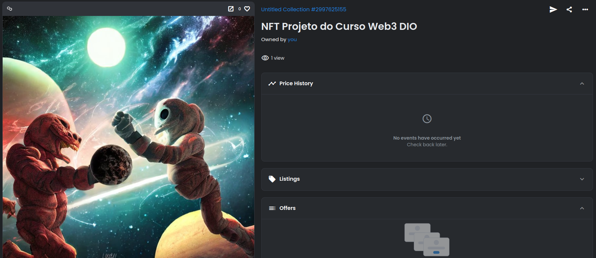
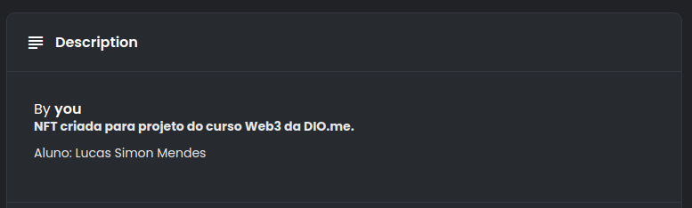

# Criando NFT para Projeto da Formação WEB3

## Acessando a NFT criada
[Link para o NFT criado](https://opensea.io/assets/matic/0x2953399124f0cbb46d2cbacd8a89cf0599974963/4517123444863708240669635810989561984192558005547379103094076835090774622209/)

## Prints

### Capa da NFT

### Descrição no Site

